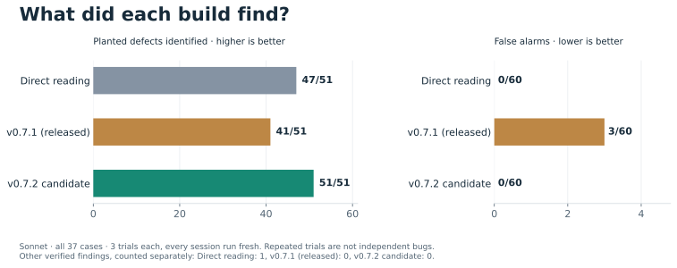
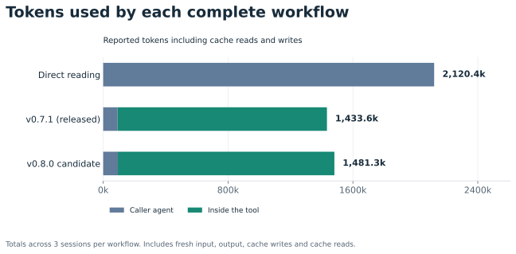
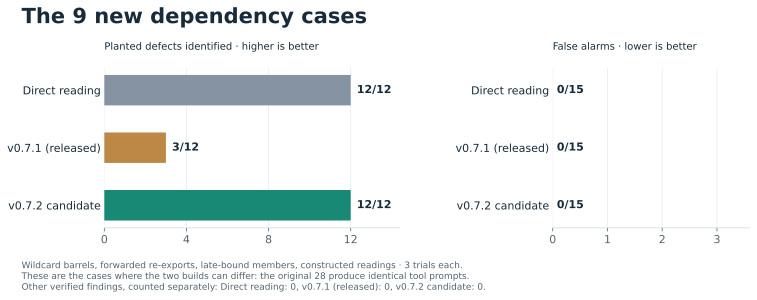
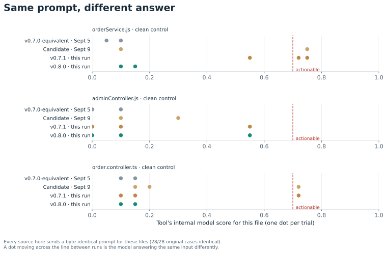

# v0.7.2 candidate vs v0.7.1: full comparison

**51/51 planted bug trials matched, plus 0 verified alternative findings. 0 false alarms.**

The detailed analysis behind [RESULTS.md](RESULTS.md). Every arm here was run fresh against
the same 37 cases: no reused sessions, no promoted baseline, no proxy build. The baseline is the
real v0.7.1 release (tag `v0.7.1`, bundle `4149dc74126d`); the candidate is
`feat/dependency-context` (bundle `7ecd7bd6667d`). All arms saw identical
source under CLI 2.1.267 (Claude Code).

| All 37 cases, three trials | Agent reads files | v0.7.1 (released) | v0.7.2 candidate |
|---|---:|---:|---:|
| Planted defects identified | 47/51 | 41/51 | 51/51 |
| Other verified findings | 1 | 0 | 0 |
| False alarms on clean files | 0/60 | 3/60 | 0/60 |
| Total reported tokens | 2,120,442 | 1,433,632 | 1,481,267 |

The candidate used 3% more total tokens than v0.7.1 and 30% fewer than direct
reading. Tokens include fresh input, output, cache writes and cache reads across the
caller and internal models. Each category is counted once.

## The 9 new dependency cases

These are the cases this branch added: late-bound members, wildcard barrels,
forwarded re-exports and constructed readings. They exist because the older corpus
barely exercises import resolution -- on the original 28 cases the two builds send
the tool's internal model byte-identical prompts, so no accuracy difference there
can be attributed to either build.

| Original 28 cases | Agent reads files | v0.7.1 (released) | v0.7.2 candidate |
|---|---:|---:|---:|
| Planted defects identified | 35/39 | 38/39 | 39/39 |
| Other verified findings | 1 | 0 | 0 |
| False alarms on clean files | 0/45 | 3/45 | 0/45 |

| **New 9 dependency cases** | Agent reads files | v0.7.1 (released) | v0.7.2 candidate |
|---|---:|---:|---:|
| Planted defects identified | 12/12 | 3/12 | 12/12 |
| Other verified findings | 0 | 0 | 0 |
| False alarms on clean files | 0/15 | 0/15 | 0/15 |

Why the builds differ on the new bug cases: each needs one definition from another
file before its defect is demonstrable. The table counts the sessions whose tool
prompt actually carried that definition, the internal model's mean score, and the
sessions where the planted defect was found.

| New bug case | v0.7.1: contract shown · mean score · found | Candidate: contract shown · mean score · found |
|---|---:|---:|
| `wildcard-discount.ts` | 0/3 · 0.15 · 0/3 | 3/3 · 0.88 · 3/3 |
| `forwarded-coupon.ts` | 0/3 · 0.32 · 0/3 | 3/3 · 0.82 · 3/3 |
| `constructed-reading.ts` | 0/3 · 0.03 · 0/3 | 3/3 · 0.90 · 3/3 |
| `late-member.ts` | 0/3 · 0.83 · 3/3 | 3/3 · 0.83 · 3/3 |

v0.7.1 found `late-member.ts` without the contract in its prompt: it inferred the behaviour of an unseen definition from a name. That is a correct answer the evidence did not demonstrate; the candidate reaches it with the definition shown.

Token totals are per session and cannot be split by case group. The per-file internal
model calls can be, and are reported in `workflow-summary-v072-full.json` under each
group's `internal` field.

## The false alarms come from the model, not the build

An earlier candidate-only run flagged two clean controls the saved baseline never had, which
looked like a regression. On all 28 original cases the tool's internal prompt is byte-identical across every source in this table, and each build sends the same prompt on every trial. The actionable threshold and scoring code are unchanged since v0.7.1. A clean control that scores differently between these sources is the model answering the same input differently.

| Clean control | v0.7.0-equivalent · Sept 5 | Candidate · Sept 9 | v0.7.1 · this run | Candidate · this run |
|---|---:|---:|---:|---:|
| `orderService.js` | 0.10, 0.05, 0.10 | 0.10, **0.75**, **0.75** | 0.55, **0.72**, **0.75** | 0.10, 0.15, 0.10 |
| `adminController.js` | 0.00, 0.10, 0.10 | 0.10, 0.30, 0.10 | 0.00, 0.55, 0.10 | 0.10, 0.55, 0.00 |
| `order.controller.ts` | 0.15, 0.10, 0.10 | 0.15, **0.72**, 0.20 | 0.15, **0.72**, 0.10 | 0.10, 0.15, 0.15 |

Scores are per trial; bold marks the actionable cut of 0.70. Listed are the clean controls
that reached 0.50 in any session. In this experiment the released v0.7.1 raised
3 false alarms and the candidate 0. That split is not a precision gain for the candidate either: with the same prompts, the candidate crossed the cut on these files in the Candidate · Sept 9 run. 2 of these files crossed the cut
at least once, and both builds send the model the same prompt for them: this is a prompt-precision
question for both builds, not a change this branch introduced.

## Provenance

- Baseline tag: `v0.7.1`, commit `9de9017ca4a78dcdc65484398d180bb1b461dfac`.
- Baseline bundle SHA-256: `4149dc74126d405075b985424c6c640612a379edaa5c9e89f71c72b6cc817a91`.
- Candidate bundle SHA-256: `7ecd7bd6667df1b1c398513da7c009ea6e7049436d99be92a9be6f6019da0887`.
- Recorded completion: `2026-09-10T12:03:42.953Z`.
- Complete results: 9 sessions, 333 file verdicts and 222 internal predictions. No unavailable results.

All nine sessions and every internal model call were recorded in this experiment. Run
order rotates by trial. The run hit the subscription usage limit twice: after the first
session, and again before the final v0.7.1 session, which ran about four hours after the
others. Failed attempts were discarded and rerun; no partial session is included. 

There are 17 buggy files and 20 clean controls. Repeated trials are not
additional bugs. These are development cases that informed the tool's prompt and its
dependency-resolution work, so this is not a held-out accuracy estimate. Findings were
reviewed for defect identity, not just a matching line number.

[Method](METHOD.md) | [Raw runs](results-v072-full.json) |
[Judgments](judgments-v072-full.json) | [Token breakdown](workflow-summary-v072-full.json)
