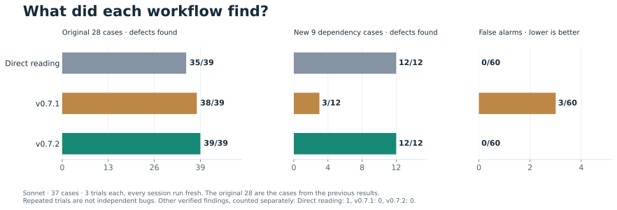
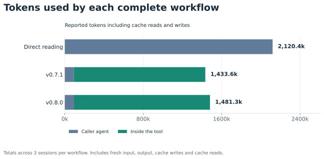

# Benchmark results

**38/39 planted bug trials matched, plus 1 verified alternative finding. 0 false alarms.**

Sonnet reviewed the same 28 JavaScript and TypeScript cases three times per workflow.
The baseline is the pinned master commit, not an intermediate development prompt.
v0.7 is an unreleased candidate. The candidate has 84 fresh predictions; master and reading baselines reuse matching saved sessions.

| Across three trials | Agent reads files | v0.6 master | v0.7 candidate |
|---|---:|---:|---:|
| Planted defects identified | 34/39 | 35/39 | 38/39 |
| Other verified findings in buggy files | 2 | 1 | 1 |
| False alarms on clean files | 0/45 | 0/45 | 0/45 |
| Total reported tokens | 2,166,359 | 1,136,211 | 1,105,371 |
| CLI-estimated cost | $1.553 | $1.490 | $1.294 |

The candidate workflow cost **13% less than the v0.6 master workflow** in this run.
It cost **17% less than direct reading**.
It used 49% fewer total tokens than direct reading.
The v0.6 baseline detected 35/39; the v0.7 candidate detected 38/39.

Tokens include fresh input, output, cache writes and cache reads across the caller
and internal models. Cache state was not reset; baseline sessions were recorded earlier. These are observed
CLI cost estimates, not subscription invoices or a guarantee of future savings.

There are 13 distinct buggy files and 15 clean controls. Repeated trials are not
additional bugs. These development cases informed the tool's prompt, so this is
not a held-out accuracy estimate. Findings were reviewed for defect identity,
not just a matching line number.

[Method and reproduction](METHOD.md) | [Raw runs](results-v07-balanced.json) |
[Defect judgments](judgments-v07-balanced.json) | [Token breakdown](workflow-summary.json)
