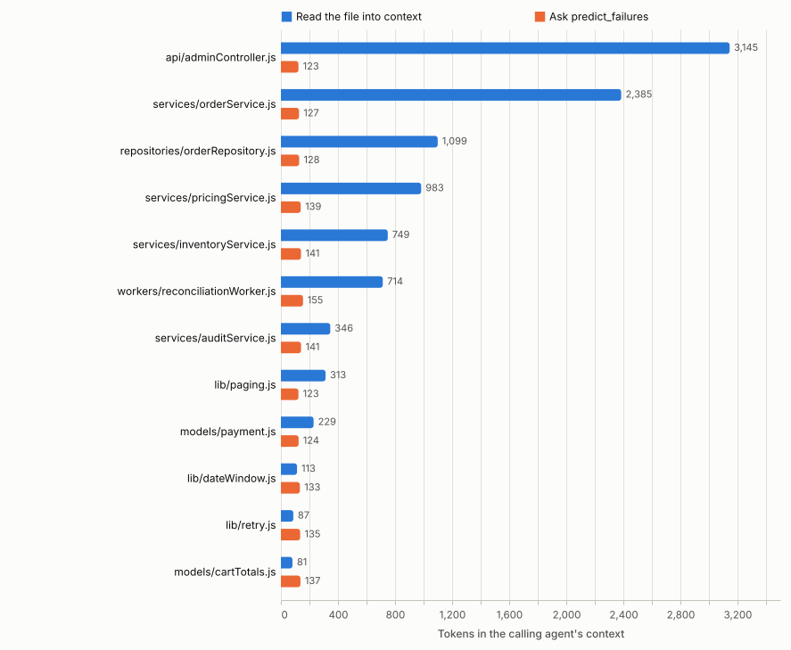
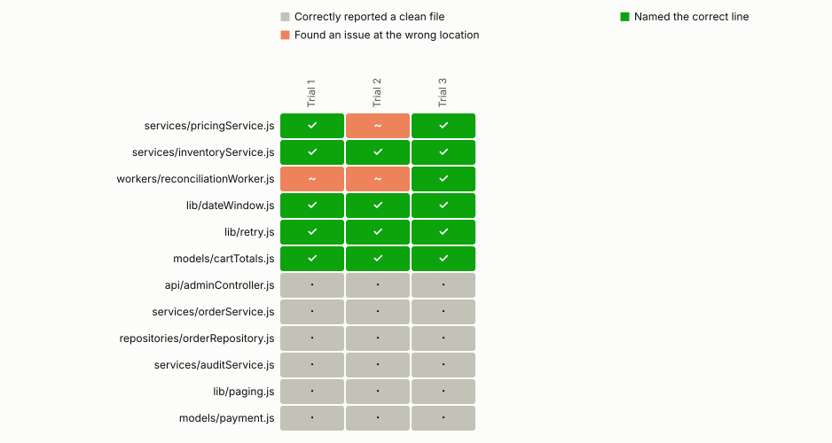
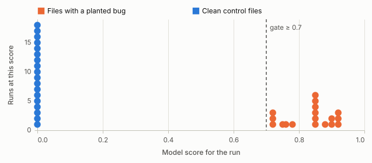
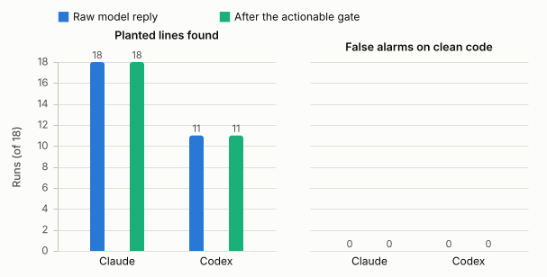
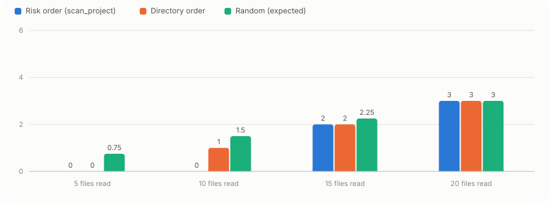

# Benchmark results

Does `predict_failures` save context for a calling agent, and is its answer
trustworthy enough to act on without reading the file?

Corpus: 40 generated files with 6 planted bugs.
The per-file test covers 12 of them: 6 buggy files and
6 clean controls. Each file gets 3 trials using the `claude` CLI.

## Bottom line

| Question | Measured answer |
|---|---|
| Does the tool reduce context? | Yes. 1,554 tokens instead of 10,344, 85% less file content. |
| Does it point to the planted line? | 18 of 18 bug trials land inside the defect's own function, 15 of 18 on the exact line. 0 pointed elsewhere. |
| Does it accuse clean files? | 0 of 18 raw trials, 0 after the 0.7 gate. |
| Does it help a real agent? | 26% fewer tokens in the A/B. Both arms found 2 of 3 bugs. |
| Does project ranking help? | At 15 files, risk order contains 4 of 6 bugs. Directory order contains 2. |
| What does one prediction cost in time? | 5.6 s mean, 19.2 s worst. |

This run has a clean precision result. No clean control received a defect.
Every prediction landed inside the function containing the defect. The tool saves context, but the extra model call means it did not make the A/B faster.

Two numbers are given for localisation because they answer different questions, and an
agent and a Problems panel need different ones. **18 of
18 predictions land inside the function the defect is in**, which is what
an agent needs to know where to look. **15 of 18 land on the
line itself**, which is what a panel that underlines one line needs.

Grading by the enclosing function replaced a tolerance of three lines either way. That
tolerance measured the wrong thing in both directions: on `lib/retry.js`, 13 lines long, it
accepted most of the file, so a prediction fell inside it by luck; and on a defect with two
defensible sites it called a correct answer a miss. `lib/retry.js` is the example of the
second. The defect swallows an error so the function resolves undefined, the key names the
`catch`, and the model names the fall-through four lines later. Both are the defect.

## How to read the report

| Term | Meaning |
|---|---|
| Trial | One independent model call on one file. Each file gets 3 trials. |
| Hit | The prediction lands inside the function the planted defect is in. |
| Wrong location | The model names a defect, but outside that function. |
| False alarm | The model names a defect in a clean control file. |
| Raw finding | What the model returned before the product applies its confidence rule. |
| Actionable | A named finding with score ≥ 0.7. VS Code may add it to Problems. |
| AUC | How well scores separate buggy and clean trials. 1.0 is perfect; 0.5 is chance. |

The five charts below are embedded from `bench/charts`. Each caption states what to look
for, and the link below each chart opens the SVG at full size.

## Visual summary

### Context used per file

<picture>
  <source media="(prefers-color-scheme: dark)" srcset="charts/context.dark.svg">
  
</picture>

[Open this chart at full size](charts/context.light.svg)

Each pair of bars compares reading the whole file with calling `predict_failures`.
The tool uses less context on 9 of 12 files. It costs more on
the smallest files because the answer itself is longer than the source.

### Result of every trial

<picture>
  <source media="(prefers-color-scheme: dark)" srcset="charts/outcomes.dark.svg">
  
</picture>

[Open this chart at full size](charts/outcomes.light.svg)

Rows are files and columns are trials. The chart shows 18 correct-line
hits, 0 wrong locations, and 18 correctly
clean control trials.

### Score separation

<picture>
  <source media="(prefers-color-scheme: dark)" srcset="charts/scores.dark.svg">
  
</picture>

[Open this chart at full size](charts/scores.light.svg)

The horizontal position is the model score from 0 to 1. Clean trials sit at 0 in this
run. Findings on buggy files start at 0.72. The vertical marker is the
0.7 actionable gate.

### Claude and Codex

<picture>
  <source media="(prefers-color-scheme: dark)" srcset="charts/providers.dark.svg">
  
</picture>

[Open this chart at full size](charts/providers.light.svg)

This chart compares raw and gated results under the same prompt. Claude hit 18
of 18 planted lines. Codex hit
11 of 18.
Neither provider raised a gated false alarm in these runs.

### Bugs found within a file budget

<picture>
  <source media="(prefers-color-scheme: dark)" srcset="charts/budget.dark.svg">
  
</picture>

[Open this chart at full size](charts/budget.light.svg)

The x-axis is the number of files an agent reads. The y-axis is planted bugs included.
At 15 files, risk-density order reaches 4 bugs.
Directory order reaches 2, and random order is expected
to reach 2.25.

## Why false alarms dropped

The default product behaviour now applies the 0.70 gate itself. Low-confidence model
hypotheses remain available as raw evidence, but they no longer become VS Code Problems;
`predict_failures` returns an explicit `actionable` boolean and a four-state `status`.
An `uncertain` result keeps its pattern, score, line and reason, but is labelled "not added
to Problems"; agents are told to report a defect only when `actionable` is true. The
classifier prompt also rejects failures that require an
invented malformed input, dependency-contract violation, or ordinary error propagation.

This is an exact replay of the same 36
Claude responses from immediately before the precision change, so the comparison has no
provider or sampling variance:

| User-visible result | Before | After | Change |
|---|---|---|---|
| False Problems on clean code | 12 of 18 | 0 of 18 | −12 |
| Planted lines surfaced as actionable | 18 of 18 | 15 of 18 | −3 |
| Machine-readable MCP decision | none | `status` + `actionable` | added |

That replay measured the reporting gate alone, holding the model output fixed. The
provider-matched Claude rerun has since been done. It measures the other half: what
the evidence policy does to the model's answers rather than to their presentation. It is
the run behind every other number in this file:

| Claude, 3 trials per file | Old prompt, replayed | Evidence policy, fresh run | Change |
|---|---|---|---|
| Clean trials naming any defect | 11 of 18 | 0 of 18 | −11 |
| Planted lines named, raw | 18 of 18 | 18 of 18 | no change |
| Buggy files reported clean | 0 of 18 | 0 of 18 | no change |

The false alarms are gone at the source. The first version of the policy took the race
condition in `workers/reconciliationWorker.js` with it. The model reported it clean in all
3 trials, because "state read and later
overwritten across an await" is exactly the kind of claim the policy asks the model to
disprove first, and a single sequential reading of the file disproves it.

The fix was to say that concurrency is not an invented input: anything on a timer, in a
polling loop, or exported as a service method can be entered again before an earlier call
finishes, unless the source shows it cannot. That is one clause, and it costs no precision:

| Claude, 3 trials per file | Evidence policy | …plus the concurrency clause | Change |
|---|---|---|---|
| Clean trials naming any defect | 0 of 18 | 0 of 18 | no change |
| Planted lines named | 14 of 18 | 18 of 18 | +4 |
| Buggy files reported clean | 3 of 18 | 0 of 18 | −3 |
| Separation (AUC) | 0.917 | 1.000 | n/a |
| Latency per file | 4.9 s | 5.6 s | +14% |

Nothing is reported clean any more, and no clean file is accused. Latency rose because the model reasons for longer. The
worst single call took 19.2 s.

Section 4 puts the two providers side by side on the same policy.

## Historical comparison

<details>
<summary>Open the full before/after history</summary>

This section tracks the route from the first benchmark to the current build. Skip it if
you only need the current result. `scan_project` ranks by
risk density rather than total risk, `combinedScore` weights the model verdict at 0.9
instead of 0.4, both tools return a much smaller payload, and the classifier prompt gained
an evidence policy and a concurrency clause. Both columns come from result files:
`baseline.json` for the left, the current `results.json` and `results-file.json` for the
right. This keeps both sides tied to measured data.

| Measure | Before | After | Change |
|---|---|---|---|
| Answer size, mean tokens per call | 251 | 130 | −48% |
| Context to ask about all 12 files | 3,007 (29%) | 1,554 (15%) | −48% |
| Files where asking beats reading | 8 of 12 | 9 of 12 | +1 |
| `scan_project` output, 40 files | 6,512 | 2,277 | −65% |
| `scan_project` shortlist, limit 10 | 1,755 | 659 | −62% |
| Where the 6 bugs rank in the scan | 11, 14, 17, 38, 39, 40 | 2, 8, 11, 12, 39, 40 | n/a |
| Bugs inside the first 15 files | 2 of 6 | 4 of 6 | +2 |
| ρ between the ranking score and file size | 0.824 | 0.366 | n/a |
| Trials landing in the defect's function | 17 of 18 | 18 of 18 | +1 |
| Buggy files reported clean | 1 of 18 | 0 of 18 | −1 |
| False alarms on clean code, raw output | 13 of 18 | 0 of 18 | −13 |
| A/B: tokens spent by the tool-using agent | 17,395 | 17,867 | +3% |
| A/B: saving against the reading agent | 26% | 26% | n/a |
| A/B: false alarms from the tool-using agent | 0 of 1 | 0 of 1 | no change |

Separation is the probability that a run on a buggy file scores above a run on a clean
one, ties counted as half. 0.5 is a coin toss; below 0.5 the number is pointing the wrong
way. This is the question "which score should an agent gate on", answered rather than
assumed:

| Score | Before | After | Change |
|---|---|---|---|
| `score`, the model verdict | 0.910 | 1.000 | n/a |
| `combinedScore`, the reported score | 0.735 | 1.000 | n/a |
| `riskScore`, static complexity | 0.333 | 0.306 | n/a |

The static complexity score is worse than chance at telling a buggy file from a clean one,
and the old blend gave it 0.4 of the vote. That is the entire reason `combinedScore`
moved.

The comparison also exposes three limits:

- **What fixed the false alarms was the prompt, not the threshold.** The lowest cut with no
  false alarms came out at 0.65, 0.6, 0.7, 0.2, 0.2 across
  5 runs of the same 18 clean trials on the same corpus.
  For the first three that number was pinned to wherever the noise stopped, and section 5
  shows an agent given 0.7, the fitted minimum at the time, reporting a defect in a
  clean file that scored exactly 0.7. The gate is now a backstop worth keeping at
  ≥ 0.7, not the mechanism.
- **Precision was bought with recall, and the corpus cannot price that trade.** Naming the
  planted line went from 17 of 18 to
  18, and latency per file from
  4.4 s to 5.6 s.
  Whether a wasted investigation costs more than a missed defect is a question about the
  person reading the output, not about this benchmark.
- **The smallest files still cost more to ask about than to read**, and always will: an
  81-token file cannot be described in
  fewer tokens than it contains.

</details>

## Detailed results

### 1. Context cost: cheaper on 9 of 12 files

The answer costs roughly the same regardless of file size: 130 tokens on
average. It contains one line number, one pattern, one rationale and two scores.
The metric block and the log stanza are behind a `verbose` flag, and the path is
echoed as given rather than resolved; before that they were four fifths of the reply.
This creates a break-even point: the tool is cheaper only for files above roughly
130 tokens, which is 9 of the 12 files here. For `models/cartTotals.js`, at 81 tokens, asking still costs more than reading.

| File | Type | Read the file | Ask the tool | Context change |
|---|---|---|---|---|
| `api/adminController.js` | clean | 3,145 | 120 | Saves 3,025 |
| `services/orderService.js` | clean | 2,385 | 127 | Saves 2,258 |
| `repositories/orderRepository.js` | clean | 1,099 | 125 | Saves 974 |
| `services/pricingService.js` | bug | 983 | 138 | Saves 845 |
| `services/inventoryService.js` | bug | 749 | 146 | Saves 603 |
| `workers/reconciliationWorker.js` | bug | 714 | 158 | Saves 556 |
| `services/auditService.js` | clean | 446 | 132 | Saves 314 |
| `lib/paging.js` | clean | 313 | 115 | Saves 198 |
| `models/payment.js` | clean | 229 | 112 | Saves 117 |
| `lib/dateWindow.js` | bug | 113 | 118 | Costs 5 |
| `lib/retry.js` | bug | 87 | 136 | Costs 49 |
| `models/cartTotals.js` | bug | 81 | 127 | Costs 46 |

### 2. Accuracy: 18 correct lines and 0 wrong locations

The savings matter only if the agent can trust the answer without reading the file
anyway. The clean files are the control group: they measure whether the tool invents
defects that are not there.

Each trial is an independent model call on the same file. **Hit** means the predicted
line is inside the function the planted defect is in. **False alarm** means the model named a
defect in a clean control. **Correctly clean** means it found none; a low-confidence guess
can also be correctly suppressed. **Missed** and **wrong location** apply only to files
with a planted bug. This table grades the raw model reply; the 0.70 product gate determines
whether it becomes an actionable Problem.

| File | Expected | Planted line | Trial 1 | Trial 2 | Trial 3 |
|---|---|---|---|---|---|
| `api/adminController.js` | Clean | Not applicable | Correctly clean | Correctly clean | Correctly clean |
| `services/orderService.js` | Clean | Not applicable | Correctly clean | Correctly clean | Correctly clean |
| `repositories/orderRepository.js` | Clean | Not applicable | Correctly clean | Correctly clean | Correctly clean |
| `services/pricingService.js` | Bug | 34 | Hit (line 36) | Hit (line 36) | Hit (line 36) |
| `services/inventoryService.js` | Bug | 28 | Hit (line 28) | Hit (line 28) | Hit (line 28) |
| `workers/reconciliationWorker.js` | Bug | 28 | Hit (line 40) | Hit (line 40) | Hit (line 40) |
| `services/auditService.js` | Clean | Not applicable | Correctly clean | Correctly clean | Correctly clean |
| `lib/paging.js` | Clean | Not applicable | Correctly clean | Correctly clean | Correctly clean |
| `models/payment.js` | Clean | Not applicable | Correctly clean | Correctly clean | Correctly clean |
| `lib/dateWindow.js` | Bug | 7 | Hit (line 7) | Hit (line 7) | Hit (line 7) |
| `lib/retry.js` | Bug | 7 | Hit (line 11) | Hit (line 11) | Hit (line 8) |
| `models/cartTotals.js` | Bug | 6 | Hit (line 6) | Hit (line 6) | Hit (line 6) |

### 3. Confidence: clean and buggy scores do not overlap

This section used to carry the precision result. Clean files drew true but generic remarks such as *"`rows.map` assumes that `db.query` always returns an array"*. The score was the only thing standing between those and the Problems panel. The evidence policy in the prompt now refuses them at the source, so there is nothing left here for a threshold to filter.

| Threshold | Bugs found | False alarms |
|---|---|---|
| 0.2 | 18 of 18 | 0 of 18 |
| 0.3 | 18 of 18 | 0 of 18 |
| 0.4 | 18 of 18 | 0 of 18 |
| 0.5 | 18 of 18 | 0 of 18 |
| 0.6 | 18 of 18 | 0 of 18 |
| 0.65 | 18 of 18 | 0 of 18 |
| 0.7 | 18 of 18 | 0 of 18 |
| 0.8 | 14 of 18 | 0 of 18 |

Every column is the same, because there is nothing to trade. Every clean trial scored 0, and every finding on a buggy file scored at least 0.72. The gap runs from 0 to 0.72, with no run of either kind inside it. Any gate in that range gives identical results, which means the threshold is currently free and currently useless.

**Keep the gate at ≥ 0.7 anyway.** It costs nothing on this run and it is the only thing standing between a change in model behaviour and the Problems panel. The refusal is a model behaviour, not a guarantee: the same corpus produced clean-file scores as high as 0.65 on earlier builds, and the independent run in section 5 saw one reach 0.

The lowest cut with no false alarms has come out at
0.65, 0.6, 0.7, 0.2, 0.2 across 5 runs of these same
18 clean trials. For the first three it was pinned to wherever the noise
happened to stop that run, which is not a property of the tool.

> **A threshold fitted on the trials used to evaluate it proves nothing.** Section 5 is the
> demonstration: a cut that swept clean here failed on the first four unseen files it met.
> What changed the result was the prompt, not the number. That is still measured on one
> corpus the policy was written against.

### 4. TypeScript: 18 of 18 planted lines, 0 of 18 false alarms

Every other number in this file is JavaScript. This one is not, and it exists because
"TypeScript is supported" was an assertion for as long as the corpus had no TypeScript in
it.

The corpus is 12 hand-written files: 6 clean
controls and 6 defects. It is written out literally rather than
assembled from templates, because the JavaScript generator's template cycling is the defect
this benchmark has caught twice. 4 of the defects are in the tool's pattern
catalogue and 2 were planted deliberately outside it. The controls carry the
syntax the analyser used to reject: decorated Nest and TypeORM classes, generics, an
`.mts` module, and one method long enough to make `longFunctions` fire, which had never
happened once across the 40 files of the JavaScript corpus.

| File | Expected | Trial 1 | Trial 2 | Trial 3 |
|---|---|---|---|---|
| `models/invoice.entity.ts` | Defect, line 28 | Hit (line 28) | Hit (line 28) | Hit (line 28) |
| `services/cache.service.ts` | Defect, line 20 | Hit (line 23) | Hit (line 23) | Hit (line 23) |
| `services/supplier.service.ts` | Defect, line 15 | Hit (line 15) | Hit (line 15) | Hit (line 15) |
| `models/cart.model.ts` | Defect, line 28 | Hit (line 28) | Hit (line 28) | Hit (line 28) |
| `lib/paginate.mts` | Defect, line 23 | Hit (line 23) | Hit (line 23) | Hit (line 23) |
| `services/sync.service.ts` | Defect, line 16 | Hit (line 16) | Hit (line 16) | Hit (line 16) |
| `api/order.controller.ts` | Clean | Correctly clean | Correctly clean | Correctly clean |
| `services/report.service.ts` | Clean | Correctly clean | Correctly clean | Correctly clean |
| `repositories/customer.repository.ts` | Clean | Correctly clean | Correctly clean | Correctly clean |
| `models/receipt.entity.ts` | Clean | Correctly clean | Correctly clean | Correctly clean |
| `lib/money.ts` | Clean | Correctly clean | Correctly clean | Correctly clean |
| `lib/headers.mts` | Clean | Correctly clean | Correctly clean | Correctly clean |

**A closed list of pattern ids was throwing away correct answers.** Before this run the
catalogue offered six ids or `none`, and `parsePrediction` forces the score to 0 whenever
the pattern is `none`. Asked about `sync.service.ts`, whose `modifiedSince` filters on
`createdAt` while its own documentation promises every record edited since a timestamp, the
model named line 16 and explained the contradiction exactly. Then it answered `none`,
because no id fitted, and the finding was discarded. That happened on every trial of both
defects planted outside the catalogue: five of fifteen buggy runs, correct and thrown away.

Adding an `other` id fixed it. `none` now means no defect; `other` means a defect that is
not one of the six. The bar is unchanged, and the evidence policy still applies. Across this
run `other` was used 9 times, never on a clean file, at scores from
0.75 to 0.97.

> **This corpus was tuned against this tool, in the same week, by the same author.** Two
> controls were rewritten because the tool flagged them, and the `other` id was added after
> seeing which runs it failed. That is fitting on the test set, and the perfect score should
> be read as "no known failure mode is left in a corpus built to expose them", not as a
> measure of TypeScript quality. The held-out evidence is section 2: JavaScript never
> motivated the `other` change and can show whether it cost anything there.

**One defect was not planted.** `invoice.entity.ts` was written as a clean control. A
nullable TypeORM column arrives as `null` rather than `undefined`, and `isSettled()`
compared against `undefined`, so every unsettled invoice reported as settled. The tool
found it on all three trials at scores from 0.72 to 0.78. It is now in the answer key marked
`discovered`, and it is the reason a hand-written control group is worth re-reading rather
than trusting.

### 5. Providers: Claude found more planted lines in this run

The same corpus, prompt and gate went through each provider's CLI once.
They do not fail the same way, and picking whichever one looks better would hide that.

| Provider | Planted lines, raw | Planted lines, gated | False alarms, raw | False alarms, gated | Separation | Latency |
|---|---|---|---|---|---|---|
| `claude` | 18 of 18 | 18 of 18 | 0 of 18 | 0 of 18 | 1 | 5.6 s |
| `codex` | 11 of 18 | 11 of 18 | 0 of 18 | 0 of 18 | 0.861 | 7.0 s |

**Claude wins on both counts** in this run. It finds 18 of 18 planted lines at the gate and 0 of 18 false alarms. One run per provider is not enough to call that a property of the models rather than of this corpus.

Separation is the probability that a run on a buggy file scores above a run on a clean
one, with ties counted as half. A value of 0.5 is chance. It is a fairer comparison than either
column of counts, because it does not depend on where the gate happens to sit.

### 6. Agent A/B: 26% fewer tokens and the same number of bugs

Two agents, the same four files, and the same task. One had to read the files; the other
could only call `predict_failures` and act on the `actionable` flag the tool returns.
Neither was told which files contained bugs.

Run against the current build: the classifier prompt carries the evidence policy and the concurrency clause, and the tool-using arm was told to report a defect only when the response says `actionable` is true, rather than being given a numeric threshold to apply.

| Measure | Without tool: reads files | With tool: calls predict_failures |
|---|---|---|
| Total tokens used | 24,160 | **17,867** |
| Time | 40.1 s | **40.3 s** |
| Source lines read | 580 | 0 |
| Bugs found | 2 of 3 | 2 of 3 |
| False alarms | 1 of 1 | 0 of 1 |

The tool-using agent spent 26% fewer tokens, read no source
at all, and took the same wall-clock time. The tool's model call costs roughly what reading four files costs. It found the same number of bugs, and it was the arm that did **not** invent a defect in the clean control.

| File | Ground truth | Without the tool | With the tool |
|---|---|---|---|
| `services/pricingService.js` | bug, line 34 | Line 36, correct | Line 35, correct |
| `workers/reconciliationWorker.js` | bug, line 28 | No finding, missed | Line 40, wrong location |
| `models/cartTotals.js` | bug, line 6 | Line 6, correct | Line 6, correct |
| `services/orderService.js` | clean | Line 14, wrong location | No finding, correct (score 0) |

The saving here is much smaller: 26% versus
85% in section 1. The difference is the agent's own
overhead: its system prompt, reasoning, and response dominate, while file content is
only part of the bill. **Section 1 measures savings on file content; section 5 measures
the savings in practice.**

The A/B exposed three details that the totals hide:

- **The arms have swapped places on the clean file.** The last A/B, run before the evidence
  policy and with a numeric gate fitted on that day's trials, had the tool reporting a defect
  in `orderService.js` and the reading agent clearing it. This time the tool scored it
  0 and returned `status: none`,
  noting that the duplicate method definitions are functionally equivalent and so not an
  observable defect. The reading agent reported a defect at line
  14. Reading the code is not a
  precision baseline that a tool has to catch up to.
- **That false alarm is the more interesting half.** The reading agent argued that
  `repo.loadBatch` returns a single object rather than an array, which is a real
  inconsistency in the generated corpus. `pricingService.js` does treat the same call as an
  object. The answer key says the file is clean, so it scores as a false alarm, and that is
  the right call for this benchmark. It is also a reminder that the key is only as good as
  the generator (see caveats).
- **`reconciliationWorker.js` splits the arms.** The reading agent concluded the arithmetic
  was consistent and reported nothing. The tool described the planted defect in words: the
  balance read before the awaits, overwritten after them. It pointed at line
  40, which is the
  write, while the key names line 28,
  the read. Both are inside `tick` and both are the defect, which is the case that retired
  the line tolerance in favour of grading by enclosing function. This A/B predates that
  change and is scored under the old rule.

### 7. Project ranking: 4 of 6 bugs in the first 15 files

At the same budget of k files, how many of the 6 bugs are included? Random ordering is the null hypothesis. With
6 bugs spread over 40 files, k files picked blind
contain 15% of them on average.

| Budget | Risk order | Directory order | Random (expected) |
|---|---|---|---|
| 5 files | 1 of 6 | 0 of 6 | 0.75 |
| 10 files | 2 of 6 | 1 of 6 | 1.5 |
| 15 files | 4 of 6 | 2 of 6 | 2.25 |
| 20 files | 4 of 6 | 3 of 6 | 3 |

The same question at an equal *token* budget, which is what the agent actually pays:

| Budget | Risk order | Directory order |
|---|---|---|
| 5,000 tokens | 1 of 6 (3 files) | 0 of 6 (3 files) |
| 10,000 tokens | 1 of 6 (7 files) | 0 of 6 (5 files) |
| 20,000 tokens | 4 of 6 (18 files) | 3 of 6 (19 files) |

The ranking uses **risk density**, weighted signals per 100 lines, rather than the total.
Ranking by the total is close to ranking by size: its rank correlation with raw file
size is ρ = 0.817, against ρ = 0.366
for density. That distinction is the whole result here. Mutations, branches and
cyclomatic complexity accumulate in step with file length, so at full weight a per-line
score just measures how assignment-heavy a file is and puts plain row mappers on top;
they are damped to a tenth of their weight, and the signals that do not scale with
length. Nested loops, async boundaries, long functions and try/catch carry the order.

The planted bugs land at ranks 2, 8, 11, 12, 39, 40 of 40, so 4 of 6 are inside the first 15 files. The 2 at the bottom, `lib/dateWindow.js` and `models/cartTotals.js`, show the limit of the method. A missing null check in a short mapper has no structural signature at all, and no complexity heuristic will rank it. Reading them costs almost nothing, which is the argument for a density ordering rather than an excuse for missing them.

> **These weights were fitted on this corpus.** Six bugs is not enough to fit anything
> safely; what supports the change is that the improvement is monotone in how much the
> length-proportional signals are damped, not that one setting happened to win.

## Caveats

- **Tokens do not disappear; they move.** `predict_failures` spawns another model that
  reads the entire file. The saving is in the calling agent's *context window*, not total
  consumption. The cost is 5.6 s of latency per file.
- **The corpus is generated, and its generator has a defect.** Files with more than eight
  methods receive duplicate method names because the name generator cycles.
  `orderService.js` defines three methods twice. This makes the "clean" controls less
  clean than intended. The measurements stand, but the corpus is less realistic than it appears.
- **Bugs are placed per file, not per line.** Three are in large files and three in small
  files. That is deliberate, and it is why section 6 reports a token budget alongside a
  file budget: a per-file placement flatters any ranking that reads the big files first,
  and only the token budget shows what the agent actually pays.
- **The headline numbers are in-sample.** The JavaScript corpus and this tool were
  built by the same author in the same week, and the classifier prompt was revised in
  response to what the corpus showed: the evidence policy, the concurrency clause and
  the `other` pattern id were each added after seeing a specific failure here. The
  density weights in section 5 were fitted on these six bugs. Nothing in this file is a
  held-out measurement, so read it as a description of known failure modes and of what
  changed when, not as an estimate of how the tool will do on your repository.
- **The TypeScript corpus was built against this tool, in the same week, by the same
  author.** Two of its controls were rewritten because the tool flagged them, and the
  `other` pattern id was added after seeing which runs it failed. Section 4 is therefore
  a statement about known failure modes, not a measure of TypeScript quality. It is also
  12 files against 40 for JavaScript.
- **3 trials per file, and two runs in the A/B test.** This is enough to
  show that the answer varies, not enough for a precise estimate. On this run every file gave the same outcome in all three trials, which is a stability the earlier, noisier builds did not have. This is still one sample.
- **Tokens are counted with cl100k BPE** (gpt-tokenizer), not Claude's tokenizer, except
  in section 5 where the figures come from the harness's own accounting. The ratios hold;
  the absolute figures in sections 1–3 are approximate.

## Run it yourself

```bash
npm install                      # gpt-tokenizer and vega are devDependencies
npm run build                    # the bench drives dist/mcp-server.js
npm run bench                    # the JavaScript corpus, all four steps below
npm run bench:ts                 # the TypeScript corpus

node bench/generate-corpus.mjs   # corpus + answer key
node bench/measure.mjs           # project level
node bench/measure-file.mjs      # per file (real CLI calls; takes a few minutes)
node bench/markdown.mjs          # this file + charts
```

Generated 2026-08-30T14:28:29.625Z.
